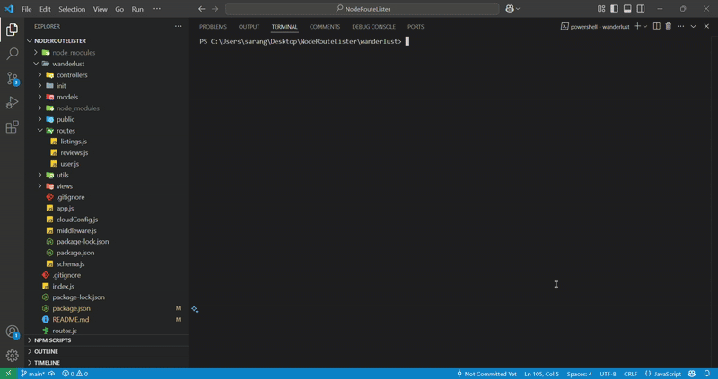

# NodeRouteLister

## npx node-lister --help

## npx node-lister <relative App File Path>

## Usage
<p> Provide an overview of all of the routes that are defined by your application from the command line.</p>

```
Options:
      --version     Show version number                                [boolean]
  -p, --path        filter endpoints by path                            [string]
  -m, --method      filter endpoints by method                          [string]
  -w, --middleware  filter endpoints by middleware                      [string]
  -r, --routing files show all routing files                            
      --help        Show help                                          [boolean]
```

<p >
    
</p>